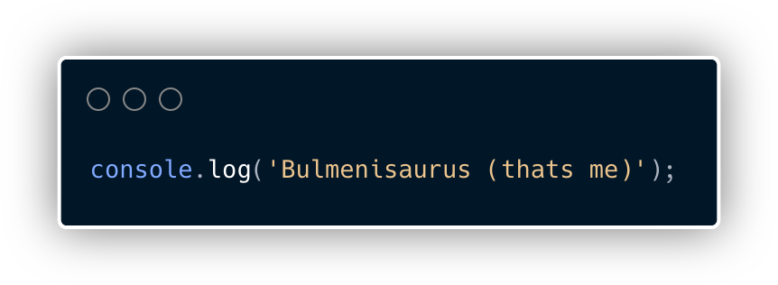

## Todo list for GitHub:

- [x] Create a [WEBSITE](https://alexeychub.com)!
  * I have a client too! 😃
- [ ] Make a Chrome Extensions
- [ ] Create an API!
- [ ] Create a [pip](https://pypi.org/project/pip/) or an [npm](https://www.npmjs.com/) package / module
- [x] 1 follower
- [x] 1 Github star 

Looks I use some languages a _bit_ more often than others... ;D

Hallo!